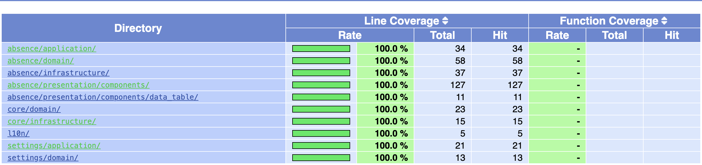

<p align="center">
  
</p>

# 🚀 Crewmeister coding challenge - Frontend (Flutter)

This is the submission for the Crewmeister coding challenge - Frontend (Flutter)

Submitted by [Ikramul Hasan](https://github.com/ikramhasan)

## How to run the project

The easiest way to test the project is by navigating to the deployed site.

### [LIVE DEMO: https://ikramhasan.github.io/absence-manager](https://ikramhasan.github.io/absence-manager)


To run it manually in you local machine, follow the steps below:

1. Clone the repository

```bash
git clone https://github.com/ikramhasan/absence-manager.git
```

2. Navigate to the project directory

```bash
cd absence-manager
```

3. Install the dependencies

```bash
flutter pub get
```

4. Run the project

```bash
flutter run
```


## Product Requirements

- [x] I want to see a list of absences including the names of the employees.
- [x] I want to see the first 10 absences, with the ability to paginate.
- [ ] I want to see a total number of absences.
- [x] For each absence I want to see:
  - [x] Member name
  - [x] Type of absence
  - [x] Period
  - [x] Member note (when available)
  - [x] Status (can be 'Requested', 'Confirmed' or 'Rejected')
  - [x] Admitter note (when available)
- [x] I want to filter absences by type.
- [x] I want to filter absences by date.
- [x] I want to see a loading state until the list is available.
- [x] I want to see an error state if the list is unavailable.
- [ ] I want to see an empty state if there are no results.
- [ ] (Bonus) I can generate an iCal file and import it into outlook.

## Additional Features

- [x] Dark Mode, and Light Mode support
- [x] Mobile and desktop responsive design
- [x] Settings page
- [x] Localization support (English and German)
- [x] Haptic feedback 

## Technical Stuff


### Code Coverage

Every single line of code has been tested with unit tests and widget tests. Here's the test coverage report:



You can verify the test coverage by running the following command:

```bash
flutter test --coverage
```

and navigating to the generated `/coverage` directory.

### Pagination

There are two types of pagination implemented in the project:

1. **Infinite Scroll Pagination**: The absence list is paginated with infinite scroll. When the user reaches the end of the list, the next page is loaded automatically. This pagination will show up in mobile devices.
  
2. **Manual Pagination**: The user can manually change the page number from the settings page. This pagination will show up in desktop devices.

### Linting

The codebase goes through a very strict linting process. You can find all the custom linting rules in the [analysis_options.yaml](analysis_options.yaml) file.


### Documentation

All the public functions, classes, variables, and enums are documented with Dartdoc. 

### CI/CD

The project is set up with Github Actions for CI/CD. The workflow is defined in the [.github/workflows/gh-pages.yaml](.github/workflows/gh-pages.yaml) file.

## Tech Stack

- Framework: [Flutter](https://flutter.dev/)
- State Management: [Flutter Bloc](https://bloclibrary.dev/)
- Persistance: [Hive](https://pub.dev/packages/hive)